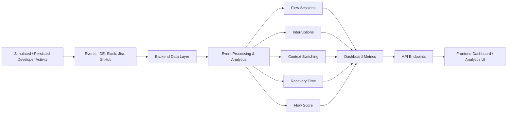

# CogniFlow

## Overview

CogniFlow is a developer workflow analytics platform built to understand how engineering work flows in practice. It focuses on the relationship between activity, focus, interruption, and recovery time, so teams can see whether work is healthy, fragmented, or constantly interrupted.

The project models developer productivity using simulated and persisted activity from IDE, Slack, Jira, and GitHub-like sources. The backend analyzes that activity and exposes structured metrics through FastAPI endpoints, while the frontend is planned as a dashboard-driven visualization layer.

> Current reality: the backend analytics layer is the implemented core. The frontend exists as a scaffold and planned UI structure for future dashboard work.

---

## Why this project exists

Engineering teams often have lots of activity data, but not enough visibility into the quality of the workday.

Common problems the project is designed to highlight:

- interruptions reduce deep work
- frequent context switching hurts flow
- teams need visibility into developer focus and recovery
- raw event volume does not explain real productivity quality
- managers need meaningful workflow signals instead of only activity counts

CogniFlow turns raw developer activity into flow-oriented metrics that can help answer:

- how much focused work is happening?
- how often are developers interrupted?
- how much switching is happening between tasks or tools?
- how long does it take to recover after disruption?
- which developers or teams are operating with better flow?

---

## Project goals

The current project is designed around these objectives:

- monitor developer activity patterns
- measure focused work time
- track flow sessions
- quantify interruptions
- measure context switching
- estimate recovery time
- calculate a flow/productivity score
- compare developer and team performance
- generate daily productivity reports
- support simulation and demonstration of workflow analytics

---

## Visual flow



This is the central design pattern of the project: raw activity becomes structured analytics, and analytics becomes operational insight.

---

## Core features

### Dashboard

The backend supports a dashboard summary that includes metrics such as:

- total developers
- total teams
- total events
- flow sessions
- focused time
- average flow duration
- interruptions
- context switches
- recovery time
- flow score

### Developer analytics

The project includes developer-level endpoints and model structure for:

- developer listing
- developer detail queries
- developer-specific summaries
- developer metric views
- activity and timeline analysis

### Team analytics

The project includes team-level structure and aggregation for:

- team listing
- team details
- team member grouping
- team-level productivity summaries

### Live monitoring

The frontend structure includes live monitoring components, and the underlying data model includes event-based activity tracking for:

- live activity feed
- developer status
- event cards
- IDE, Slack, Jira, and GitHub activity streams

### Analytics modules

The backend analytics layer covers:

- flow analytics
- interruption analytics
- context-switch analytics
- recovery analytics
- activity summaries

### Timeline and reports

The system supports:

- chronological activity timeline
- event filtering by source and date
- daily productivity reporting
- report-level aggregation for developers, teams, flow, and interruptions

### Simulation

The backend includes a simulation runner that can generate a workday of simulated activity and process it through the analytics pipeline.

---

## How CogniFlow works

```text
Activity Data
    ↓
Raw Events
    ↓
Database Storage (PostgreSQL + SQLAlchemy)
    ↓
Analytics Processing
    ↓
Flow Sessions + Interruptions + Context Switches + Recovery + Flow Score
    ↓
API Layer (FastAPI)
    ↓
Dashboard / Developer / Team / Report Views
```

The system is designed as a data pipeline:

1. simulated development activity is produced or persisted
2. event records are stored in the database
3. processing services calculate workflow metrics
4. derived analytics are persisted as metric data
5. endpoints expose the results to the application layer
6. the frontend dashboard consumes the API output

---

## Productivity metrics

The project centers on metrics that reflect the health of developer work rather than only raw event counts.

### Focused time
Measured as the time associated with sustained flow or focused work sessions.

### Flow sessions
Discrete periods of developer work that are treated as meaningful flow windows.

### Average flow duration
The average length of a flow session across the analyzed period.

### Interruptions
Counts or summaries of workflow disruption events.

### Context switches
Transitions between tasks, tools, or workstreams that indicate fragmentation in attention.

### Recovery time
Time required to regain productivity after interruption or disruption.

### Flow score
A project-defined summary indicator that reflects the developer or team workflow quality based on the available simulation and analytics data.

### Events
Raw activity records representing developer actions and communication events.

---

## Flow score

The flow score is the main summary metric in CogniFlow. It is not an external scientific benchmark; instead, it is a project-defined analytics score built from the available workflow signals:

- focused time
- flow sessions
- interruptions
- context switching
- recovery time
- overall activity patterns

In other words, the score is meant to communicate how healthy or productive a developer or team’s work pattern appears within the system’s simulated analytics model.

---

## Technology stack

### Backend

The implemented backend uses:

- Python
- FastAPI
- SQLAlchemy
- PostgreSQL
- psycopg
- Alembic
- Pydantic
- Uvicorn
- Python dotenv

### Frontend

The repository currently contains a frontend scaffold for:

- React
- Vite
- JavaScript / JSX
- CSS styling

This UI layer is planned and scaffolded, but it is not yet a fully implemented frontend experience.

---

## Project structure

```text
CogniFlow/
├── backend/
│   ├── alembic/
│   ├── app/
│   │   ├── api/
│   │   ├── core/
│   │   ├── models/
│   │   ├── schemas/
│   │   ├── seed/
│   │   ├── services/
│   │   ├── simulator/
│   │   └── tests/
│   ├── README.md
│   ├── requirements.txt
│   └── alembic.ini
├── frontend/
│   ├── public/
│   ├── src/
│   ├── .env
│   ├── .env.example
│   ├── .gitignore
│   ├── index.html
│   ├── package.json
│   ├── vite.config.js
│   └── README.md
├── README.md
└── ...
```

Important directories:

- backend/app: API app, services, routes, models, and simulation pipeline
- backend/alembic: database migrations
- frontend/src: UI structure for pages, components, hooks, routes, and services

---

## API layer

The active backend exposes the following endpoints.

| Method | Endpoint | Purpose |
|---|---|---|
| GET | `/` | API metadata and status |
| GET | `/health` | Health and database status |
| GET | `/api/teams` | List simulated teams |
| GET | `/api/teams/{team_id}` | Get one team |
| GET | `/api/developers` | List simulated developers |
| GET | `/api/developers/{developer_id}` | Get one developer |
| GET | `/api/tasks` | List simulated Jira tasks and bugs |
| GET | `/api/tasks/{task_id}` | Get one task or bug |
| GET | `/api/events` | List all activity events |
| GET | `/api/events/{event_id}` | Get a single event |
| GET | `/api/flow` | Get flow analytics |
| GET | `/api/interruptions` | Get interruption analytics |
| GET | `/api/context-switching` | Get context-switch analytics |
| GET | `/api/recovery` | Get recovery analytics |
| GET | `/api/dashboard` | Get overall dashboard metrics |
| GET | `/api/dashboard/developer/{developer_id}` | Get one developer dashboard summary |
| GET | `/api/reports/daily` | Get daily productivity report |
| POST | `/api/simulation/run` | Run simulation and process generated activity |

---

## Daily report

The project includes an implemented daily report endpoint that summarizes a given workday using persisted simulated activity.

The report typically includes:

- date
- team count
- developer count
- event count
- flow session count
- total focused time
- average flow duration
- interruption count
- context switch count
- recovery time
- flow score

This makes it useful as a daily snapshot of workflow health and productivity trends.

---

## Frontend status

The frontend is intentionally structured to match the dashboard and analytics concept of the project. It contains page and component folders for:

- Dashboard
- Live Monitor
- Developers
- Developer Detail
- Teams
- Team Detail
- Flow Analytics
- Interruption Analytics
- Context Switching
- Recovery Analytics
- Timeline
- Reports
- Simulation
- Settings
- Profile
- Not Found

This structure is a planned implementation layer and should be treated as a scaffold for future development. The actual live analytics layer remains in the backend.

---

## Running the project

### Quick Start (One Command for Both Backend & Frontend)

From the root directory:

```bash
npm install
npm run dev
```

This starts:
- **Backend**: FastAPI API server on `http://127.0.0.1:8000`
- **Frontend**: Vite React UI on `http://127.0.0.1:5173`

> **Note on Database**: CogniFlow automatically connects to PostgreSQL if available via `DATABASE_URL`. If PostgreSQL is not running locally during development, it automatically falls back to an embedded SQLite database (`cogniflow_dev.db`) and seeds initial demo data automatically.

### Running Components Individually

#### Backend Only

```bash
cd backend
python -m uvicorn app.main:app --host 127.0.0.1 --port 8000 --reload
```

#### Frontend Only

```bash
cd frontend
npm install
npm run dev
```

---

## Current project status

CogniFlow is currently best described as:

- a backend-driven workflow analytics platform
- a PostgreSQL-based simulation and analytics system
- a developer productivity and flow monitoring project
- a structured frontend scaffold for future dashboard development

The strongest implemented part of the project is the analytics engine and API layer. The frontend remains a planned visual layer that is intended to consume the backend data.

---

## Summary

CogniFlow helps teams understand developer productivity through the lens of workflow quality rather than raw activity volume. It focuses on flow sessions, interruptions, context-switching, recovery, and the overall health of engineering work.

The project is currently strongest in its backend analytics pipeline and simulated data model, with a clear path toward a full visual dashboard experience in the frontend.
